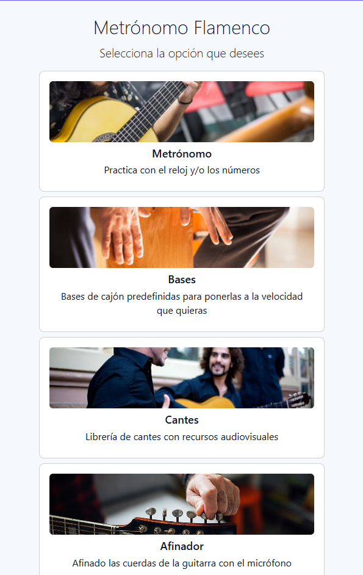
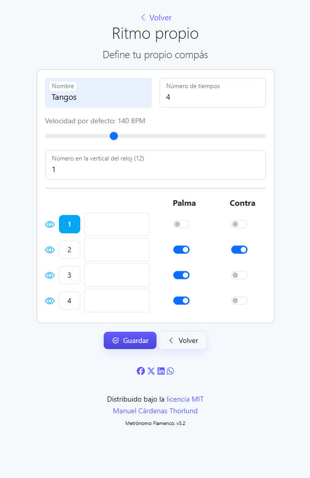
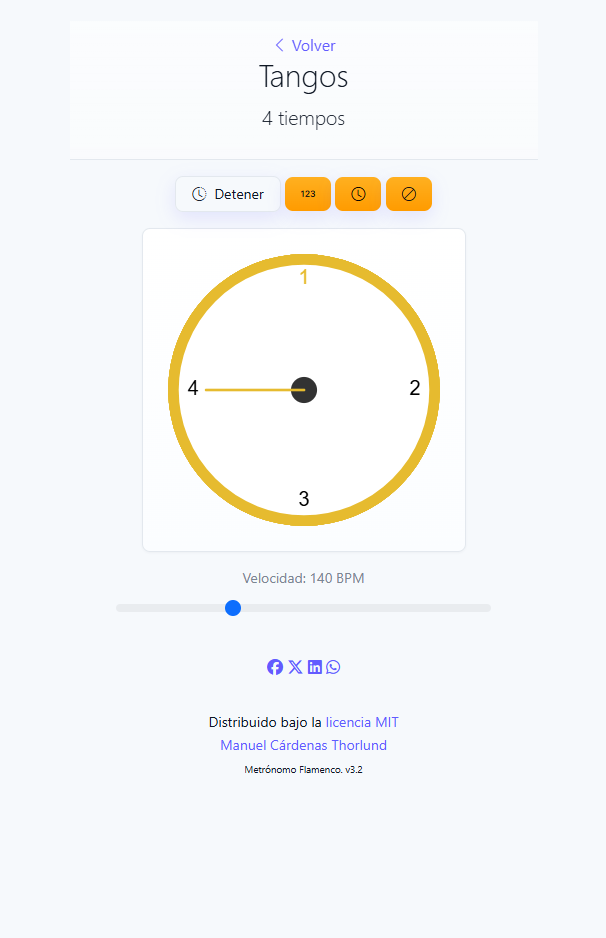
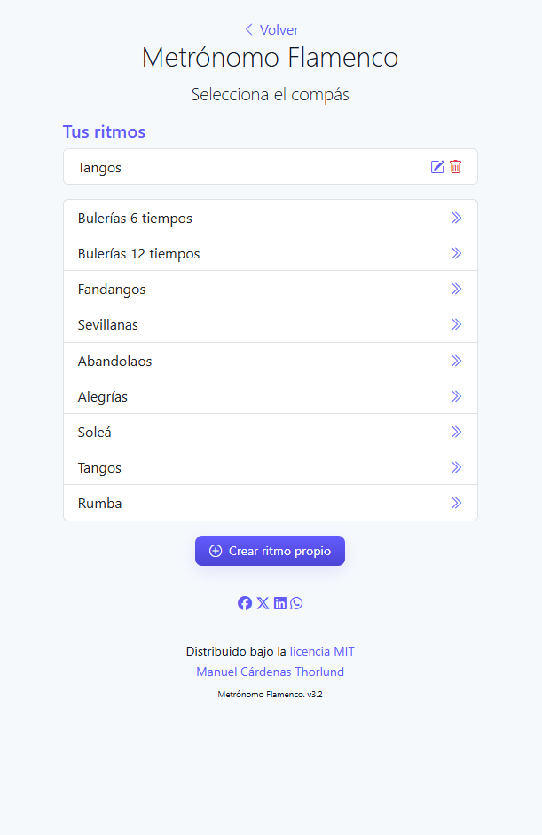
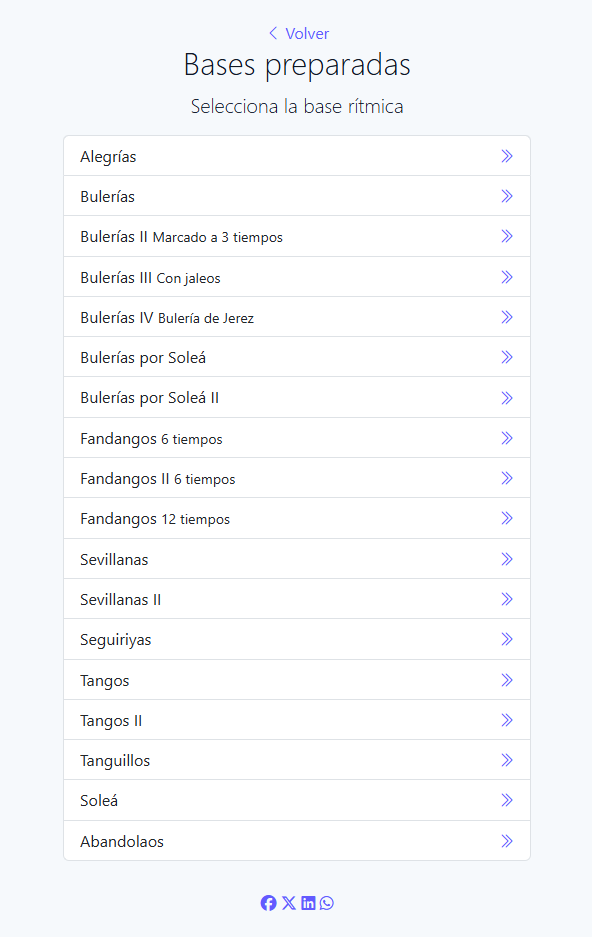
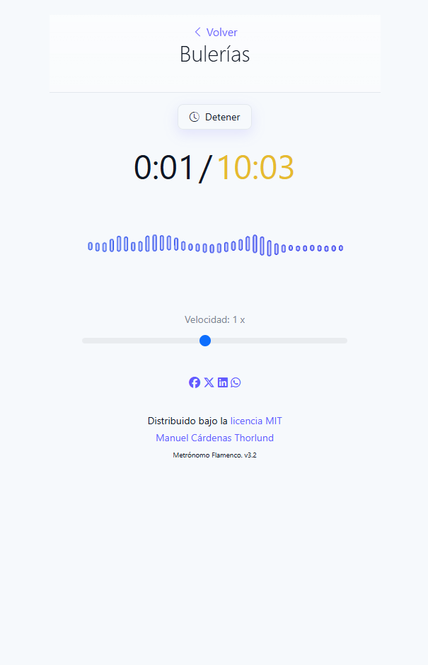
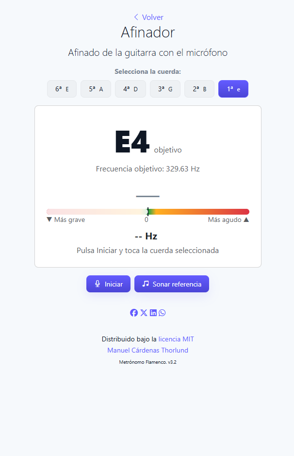

 

<h3 align="center">Metrónomo Flamenco</h3>

Un metrónomo para practicar el flamenco. Dispone de la opción de incorporar bases rítmicas, la de usar el compás con reloj y números, crear tus propios ritmos y afinar la guitarra con el micrófono.

 
 
<a href="https://metroapp.ideasypruebas2.es/">Ir al metrónomo</a>  

 ## Sobre el proyecto

Hay muchos metrónomos para la práctica de la guitarra pero ninguno se adapta completamente a mis necesidades así que me fabriqué el mío propio. Las funcionalidades son las siguientes:

- Compases predefinidos para la práctica con los que podrás trabajar con el reloj, solo con los números o solo con las palmas (sin ver reloj ni números). Puedes tocarle la velocidad como quieras
- Creación de ritmos propios: define tu propio compás (tiempos, palmas, contratiempos, acentos y velocidad) desde un editor visual. Tus ritmos se guardan en el dispositivo y aparecen en una lista aparte con opciones para editarlos o eliminarlos
- Bases rítmicas para poder practicar con bases de internet. A las bases les puedes tocar la velocidad sin cambiar el tono.
- Afinador de guitarra española: capta el sonido de cada cuerda con el micrófono y muestra visualmente si está más grave o más aguda, indicando cuándo queda afinada. Incluye un sonido de referencia de la nota objetivo
- Tanto los compases como las bases y los cantes se definen en archivos JSON para que sean fácilmente actualizables y se leen en tiempo de ejecución
- Se incorpora el Service Worker y el Manifest para que se pueda instalar como PWA en cualquier dispositivo

### Capturas de pantalla

<table>
  <tr>
    <td></td>
    <td></td>
    <td></td>
  </tr>
  <tr>
    <td></td>
    <td></td>
    <td></td>
  </tr>
  <tr>
    <td></td>
  </tr>
</table>

 ### Implementado con

El metrónomo está realizado con las siguientes librerías de apoyo:

- [Bootstrap](https://getbootstrap.com)
- [Howler JS](https://howlerjs.com)
- [FontAwesome](https://fontawesome.com)

## Licencia

Distributed under the MIT License. See [MIT License](https://opensource.org/licenses/MIT) for more information.
 ## Contacto
LinkedIn : [https://www.linkedin.com/in/manuelcardenasthorlund/](https://www.linkedin.com/in/manuelcardenasthorlund/)

Enlace del proyecto: [https://github.com/mcardenasthorlund/metronomo](https://github.com/mcardenasthorlund/metronomo)